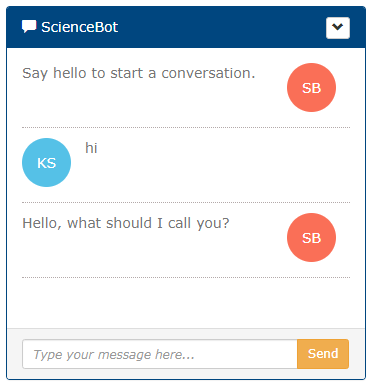

# Chatbot

A Simple Chatbot Widget for website.




## Getting Started

### Prerequisites

+ AWS Lex Bots
+ node.js v10

### Installing


1. Make AWS Lex Bots.
2. Try npm command.
```
   npm install chatbots
```
3. Replace following AWS configurations.
```
   region, IdentityPoolId, botName: 
```

### Running

Access http://localhost/chatbot/


## Versioning

Version 1.0
